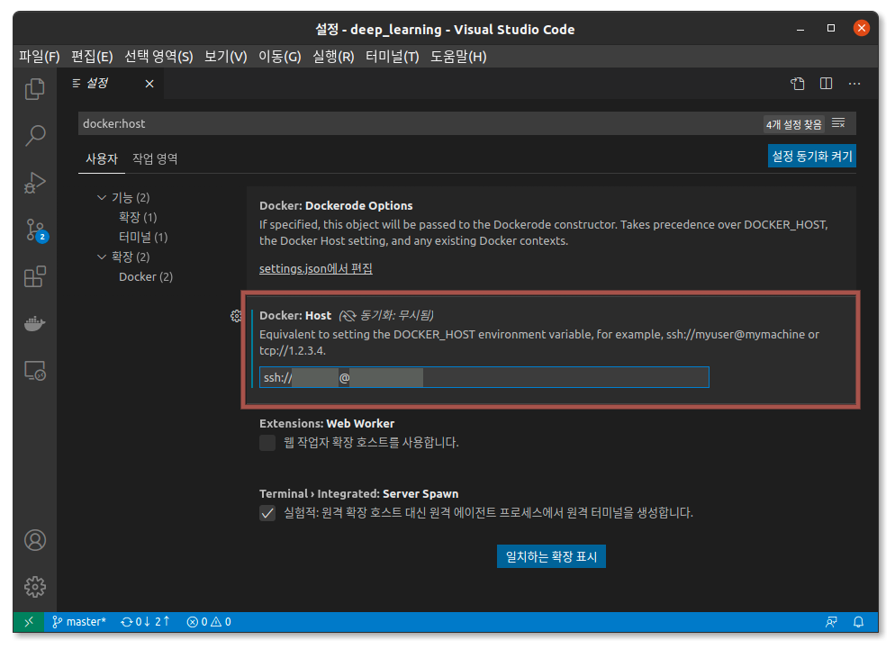

# Docker

## root 권한을 사용하지 않고 docker 관리

* docker 그룹 생성
    ```
    sudo groupadd docker
    ```
* docker 그룹에 사용자 추가
    ```
    sudo usermod -aG docker $USER
    ```
* sudo 없이 명령이 실행되는지 확인
    ```
    docker run hello-world
    ```

## vscode에서 원격으로 docker containder 연결
* Visual Studio Code (vscode) 설치 - [Visual Studio Code on Linux Installation](https://code.visualstudio.com/docs/setup/linux) 참고
* vscode extension에서 Remote Development 설치
* ssh key 생성
    ```
    ssh-keygen -t rsa
    ```
    비밀번호 없이 접속하는 것이 목적이기에 passphrase는 생략
* 공개키를 docker 서버로 전송
    ```
    scp $HOME/.ssh/id_rsa.pub egoing@egoing.net:id_rsa.pub
    ```
* ssh로 docker 서버에 접속 후 공개키 authorized_keys에 추가
    cat $HOME/id_rsa.pub >> $HOME/.ssh/authorized_keys
    rm $HOME/id_rsa.pub
    ```
* vscode의 setting에서 docker:host로 검색 후 host에 docker 서버 추가
    
* vscode에서 f1 키를 누르고 Remote-Containers: Attach to Running Container
* 원하는 docker container 선택

## 참고문서
1. [docker guides rootless](https://docs.docker.com/engine/security/rootless/)
2. [SSH Key - 비밀번호 없이 로그인](https://opentutorials.org/module/432/3742)